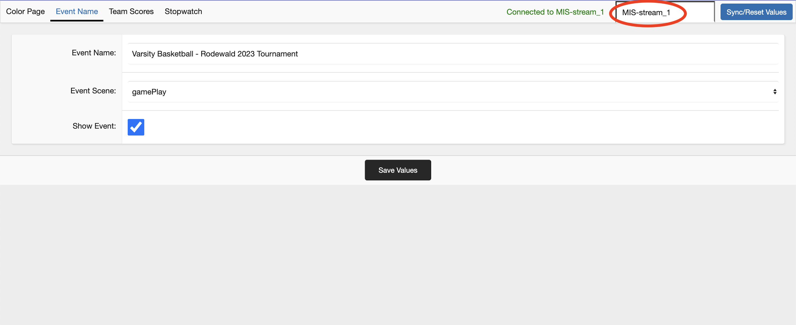

PlayVision™ Documentation
=================

## 1. First Time Setup

In order to setup your PlayVision™ software, navigate to your file directory with the 'cd' command. For example:
```sh
cd /Users/livestreamCodeFolder/
```
And then run the following command in terminal or command line to initialize the server:
```sh 
python3 run.py
```
During the setup, you will be asked for your AWS access and secret keys as well as your database name, which can be changed later, as per section 3. You may leave them blank and then add them manually in the [streamData.js](./streamData.js) file, however it is not recommended to complete the setup this way. The server will start as normal, however most parts of it won't work.<br>

<font style='color: red; weight: 300px'>**If you want to stop the setup or server at any point you may do so with Ctrl+C**</font>

Once the initial setup has been completed, the server should automatically start up. In the command line interface, you can see some useful info such as the local address of the control panel and renderers.
<br><br>

## 2. Post Setup Running

Once you have completed the initial setup, you can start the server with the same command used to set it up, however if you want the server to start with the control panel already open automatically, you can add the 'gui' keyword as such:
```sh 
 python3 run.py gui
```
Which will start the server like normally and open the control panel as well.
<br><br>

## 3. Switching Stream Databases

PlayVision™ software allows for controlling multiple streams at once from one machine remotely, and there are two distinct ways to switch between streams depending on whether you want to switch the stream being rendered on a machine, or whether you want to switch which stream your contol panel is controlling. 


>#### Control Panel Switching
>Switching the subject of a control panel instance is very easy. Just change the name of the database in the top right to one of your assigned databases (Syntax matters), and click on 'Sync/Reset Values'. <br><br>
><br><br>
>Once the text in the top right says you are connected, you are good to go.<br><br>

>#### Renderer Switching
>Switching renderers isn't as simple as switching control panel since it isn't assumed you would need to switch database mid-stream, but it still is far from complicated. <br>
>To switch renderer database, go to your [streamData.js](./streamData.js) file and change the value of `dbName` to one of your assigned databases. Then, start or restart the broadcasting server and your new stream should be assgined to your chosen database.<br><br>

<br>

## 4. Troubleshooting